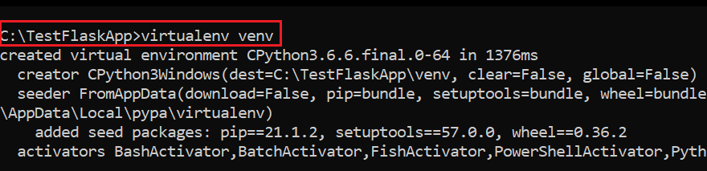
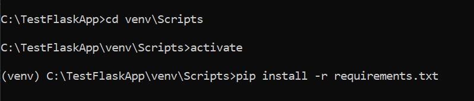
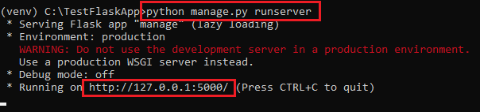
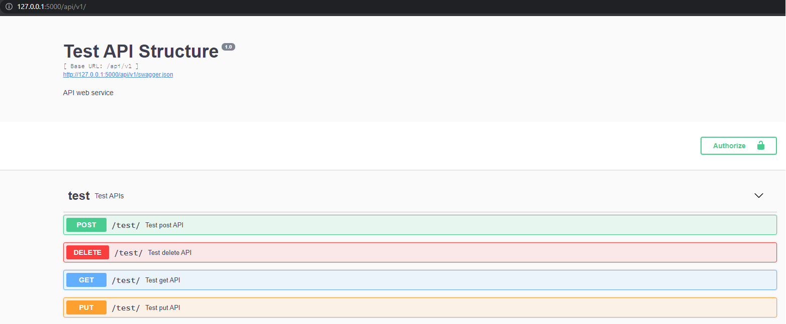

#Test Flask App

#Installation:
##Python-version: 3.6

###Create a Virtual Environment in the root directory: 
>virtualenv venv
>

###Activate the Virtual Environment:
> venv/Scripts
>activate

###Install dependencies in the activated environment: 
>
>pip install -r requirements.txt

###Start the application from the root directory
>python manage.py runserver
>

###Open the url in the browser
>http://127.0.0.1:5000/api/v1
>Note: append "/api/v1" at the end of the url
>>
